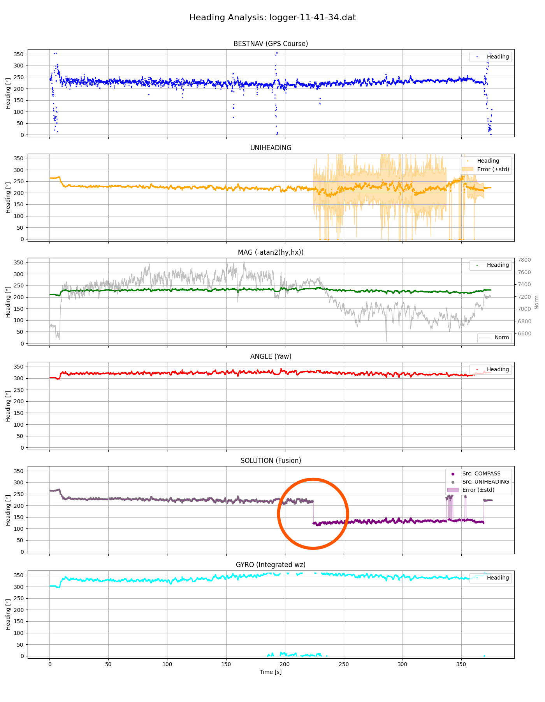
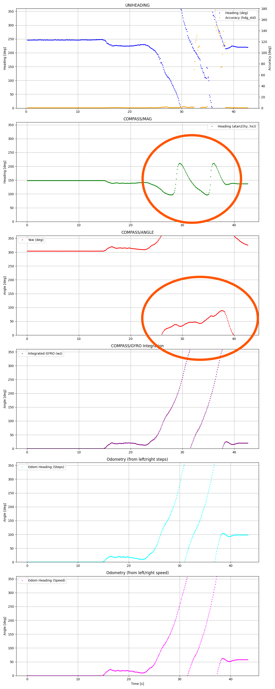
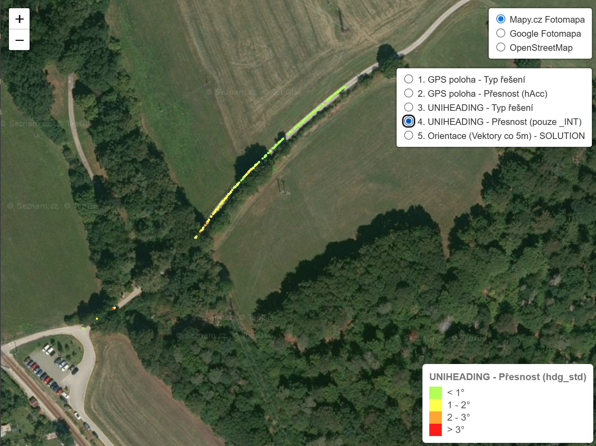
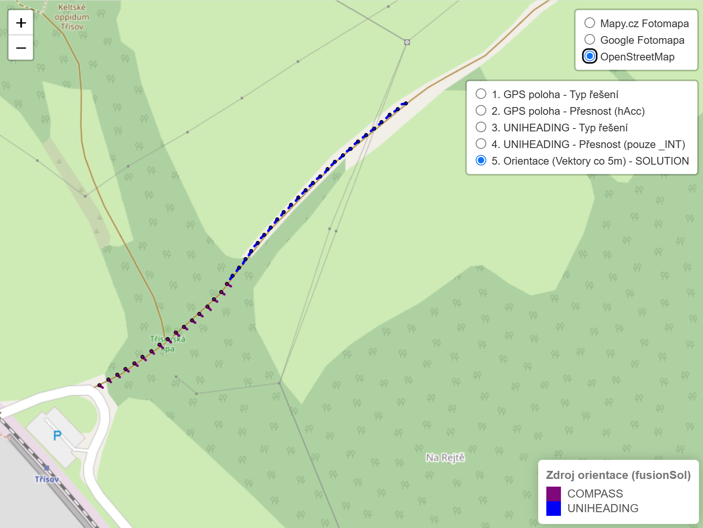
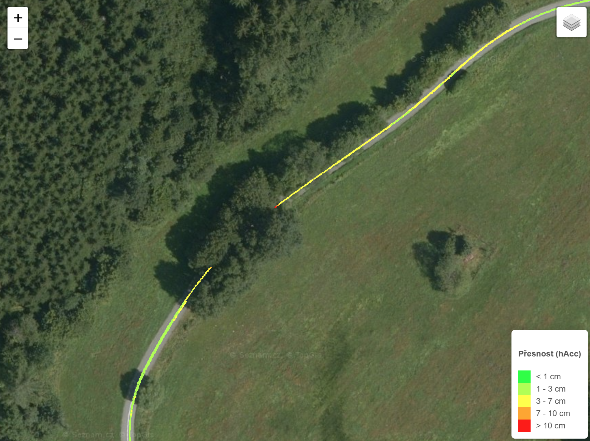
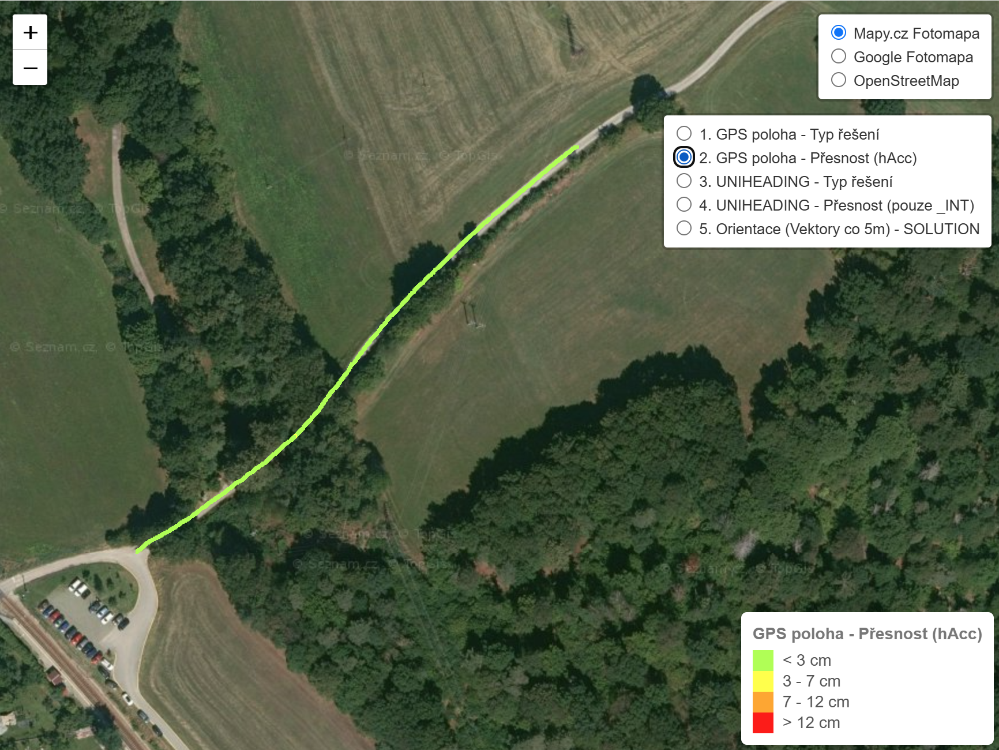

# Dívka 2026 II (1.8.2026) - Analýza dat

* **GPS poloha**: Unicore UM980 + L1/L2/L5 anténa, RTK + PPP korekce 
* **Dual Anténa Heading**: Unicore UM982 + L1/L2 antény
* **10-Axis IMU**: Hiwonder IM10A

## Shrnutí

Řešení řízení robota bylo postaveno na záznamu GPS polohy. Záznam byl pořízen večer před startem (cca 1 km trasy). 

Všechny pokusy při závodu vedly k tomu, že robot postupně sjížděl z cesty a systematicky uhýbal na pravou stranu. 

Analýza dat po závodu ukázala, že fúze headingu a IMU obsahovala systematickou chybu 90 stupňů. Robot si myslel, že jede správným směrem, ale ve skutečnosti byl natočený do příkopu.

## Analýza logu

Z logu je patrné, že robot při ztrátě heading z duální antény přepnul na heading z IMU. Úhel se skokově změnil.

  
  

  <em>Vlevo: Záznam logu při manuálním vedení robota. Vpravo: Otočení robota o 2x360 stupňů.</em>

Další zkoumání dat z IMU ukázalo zásadní problém pro integraci. Když jsem robota otočil na místě dvakrát dokola, magnetické pole (MAG) se neotočilo, a výsledný reportovaný úhel (ANGLE) tak není správný. Nicméně Gyroskop (GYRO) na první pohled poskytuje správné informace. (Tato zjištění budou předmětem změny kódu a vylepšení integračního řešení; dalším krokem bude už jen ze zvědavosti snížení množství železa v okolí kompasu zda je příčinou chybného reportování). 

## Kvalita headingu 

Robot se pro orientaci primárně spoléhá na GNSS heading (duální anténu a Unicore UM982) a v případě potřeby se záložně přepíná na heading (úhel) z IMU. 

  
  

  <em>Vlevo: GNSS Heading a jeho chyba. Vpravo: Fúze směru orientace.</em>

Mapa jasně ukazuje chybu orientace v částech, kde byl GNSS heading nepřesný, což je důsledek chyby v kalibraci IMU vůči robotovi.

## Kvalita GPS dat 

Robot byl osazen novou GNSS jednotkou Unicore UM980 s novou anténou pro příjem všech satelitních systémů a frekvencí L1/L2/L5 a s PPP korekcí. Jedná se o náhradu za původní L1/L2 anténu a u-blox F9R GNSS modul.

  
  

  <em>Vlevo: GPS záznam ze soutěže Tulák. Vpravo: GPS záznam z Dívky.</em>

Modul Unicore UM980 společně s RTK korekcemi a L1/L2/L5 anténou byl schopen udržet RTK fix i pod stromy, zatímco u předchozího řešení (u-blox F9R s L1/L2 anténou) RTK pod stromy vypadávalo.

## Závěr

Je třeba opravit fúzi headingu a IMU, aby robot lépe zvládal situace, kdy je GNSS heading nepřesný.

Modul UM982 je principiálně na primární anténě shodný s UM980 a na sekundární anténě pro určení směru používá L1/L2. Vyvstává otázka, zda pro sekundární přijímač nevyužít původní anténu od F9R, která by mohla mít lepší zisk. Což je předmětem dalšího zkoumání. 

## Interaktivní mapa

Interaktivní mapa (online náhled): [divka_2026_mapa_kompletni.html](https://unidroids.com/robot-platform/hosting/divka_2026_mapa_kompletni.html)
