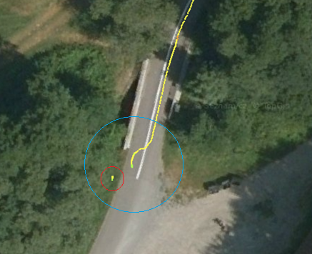

# Tulák po Krasu 2026 - Rozborka dat

U-blox F9R ZED-F9R-001 RTK GNSS

## RTK-FIX - ONLY

Ukázka dostupnosti RTK-FIX na celé trase (vlevo). Inicializace, kdy senzor pošle RTK-FIX, ale pozice má zpožddění zobrazení (napravo). Celou dobu robot byl na cestě!

  
  

Interaktivní mapa (online náhled): [mapa_hacc.html](https://htmlpreview.github.io/?https://github.com/unidroids/robot-platform/blob/main/challenges/Tulak_po_Krasu_2026/mapa_hacc.html)
*(má možnost výběru vrstev zobrazení OSM, Google, Seznam - ovládané vpravo nahoře)*

