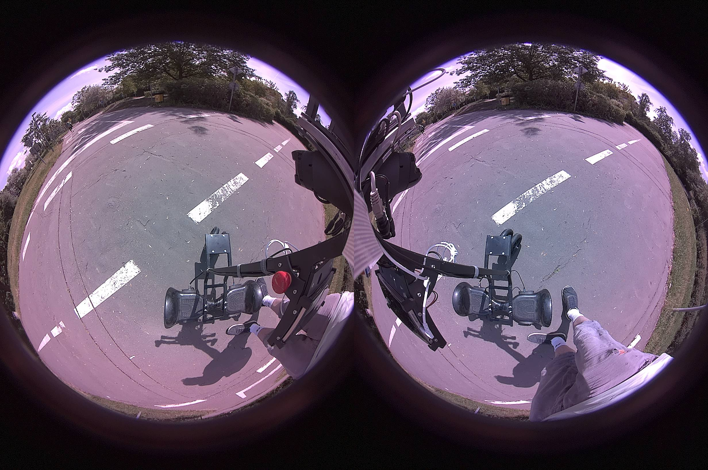
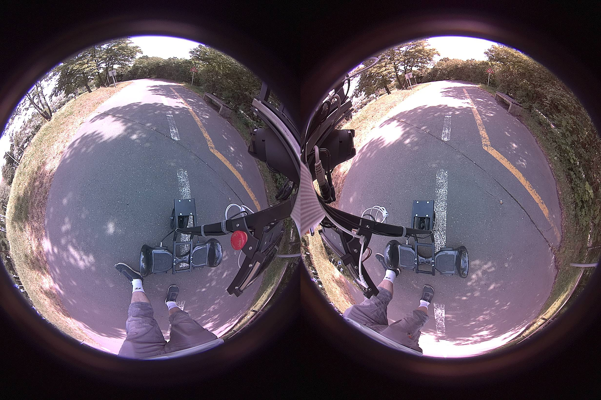
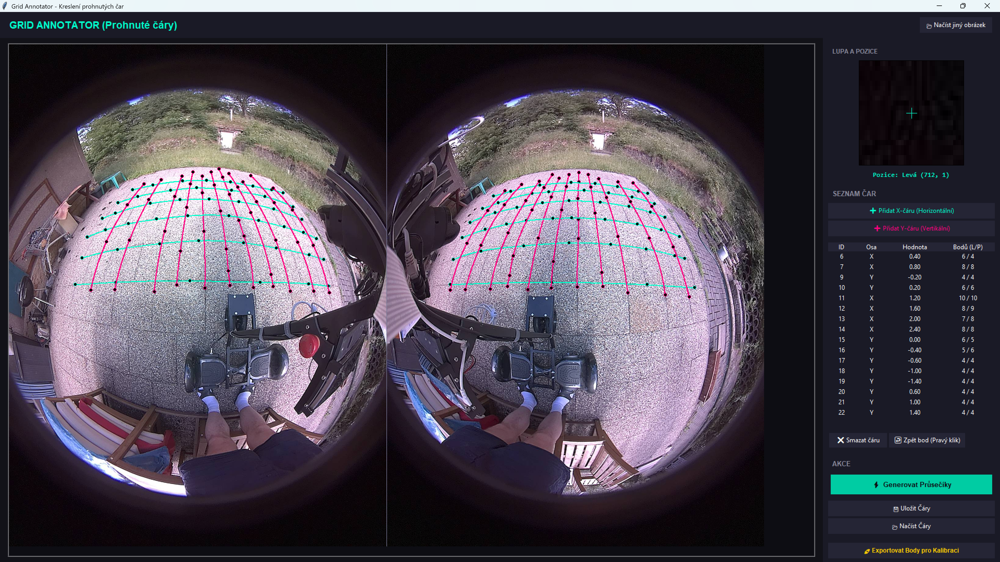
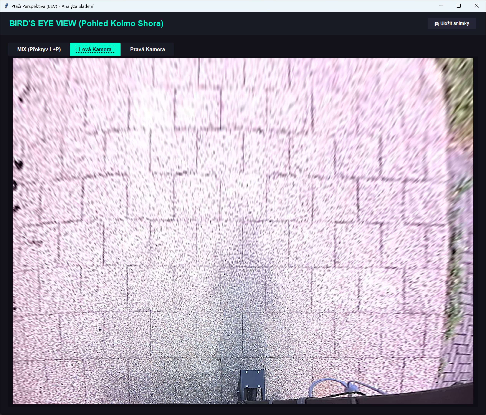
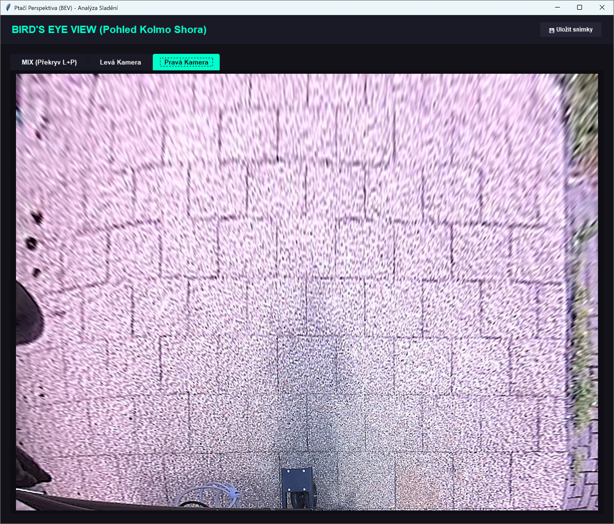
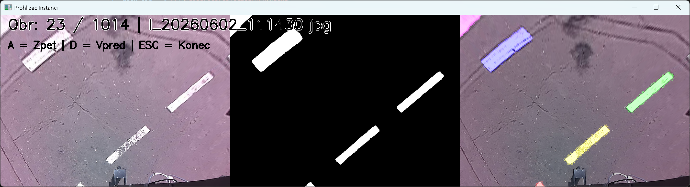
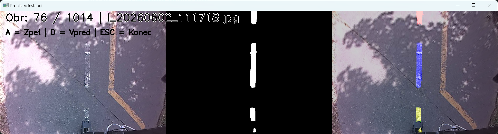
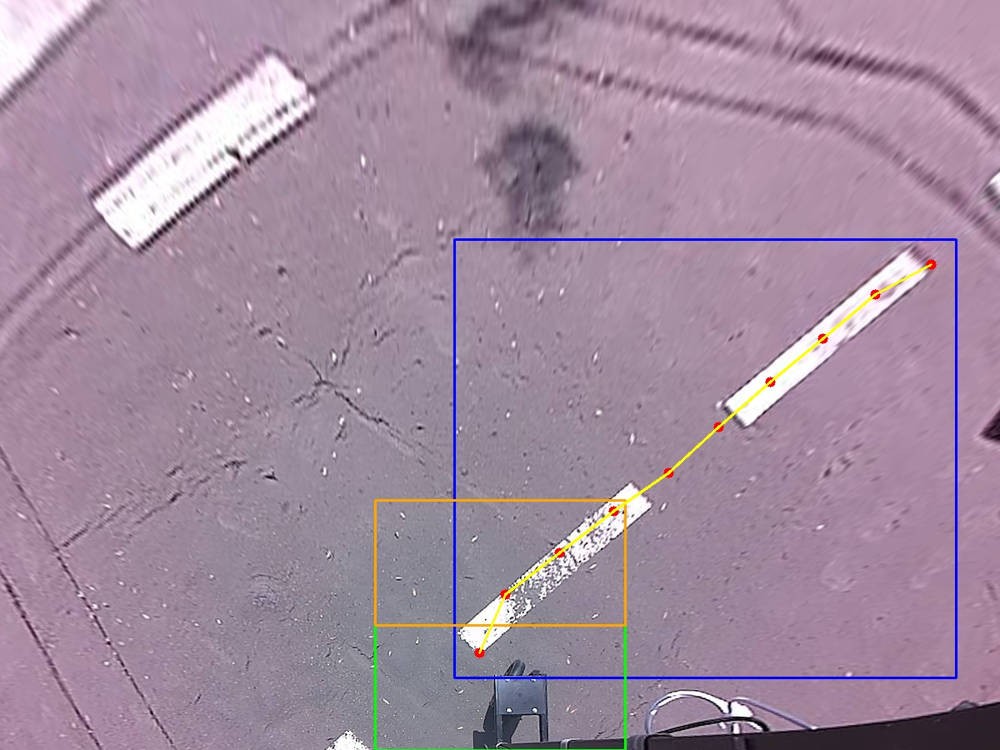
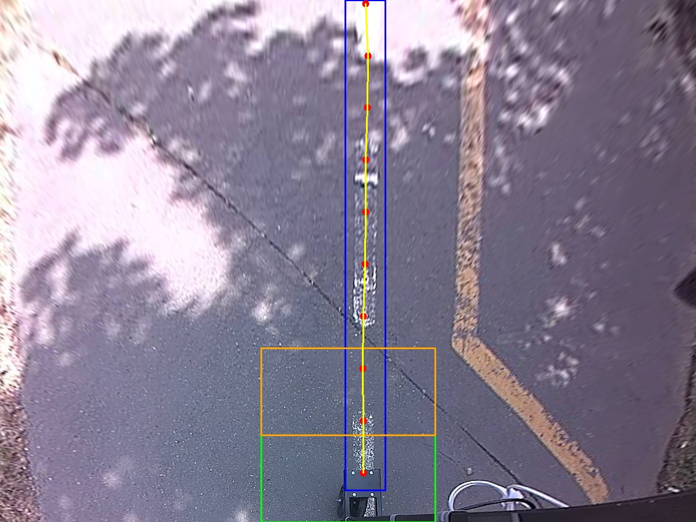

# Přípravy na soutěž Tulák po Krasu 2026

**Mise:** Moravský kras, 2,8 km dlouhý polygon tvořený vodící čárou s točnou na konci.  
**Hlavní výzva:** Rozchodit a odladit modul `vision`.

## Krok za krokem – „A dva, tři, šou, dva, tři :)“

Vše začalo nenápadně. Se stávající kamerovou službou jsem vyrazil na procházku po dětském dopravním hřišti. Byl krásný slunečný den a ideální příležitost nasbírat kvalitní zdrojová data z kamer.

  
  

Následovala kalibrace kamer a transformace obrazu do ptačí perspektivy (BEV – *Bird's Eye View*), což obnášelo oblíbené ruční „klikání“ bodů na zámkové dlažbě. :)

  
  
  

Pak přišla na řadu klíčová a naštěstí šťastná volba neuronové sítě. Zvolil jsem **YOLO-pose**, protože detekované body de facto představují vektor trasy, který má robot sledovat.

### Anotace a trénování

Dalším krokem byly anotace. Pro nalezení bílé čáry na asfaltu v BEV pohledu skvěle posloužil model **SAM3**. K tomu jsem přidal vlastní skript, který z pohledu od středu robota generoval potřebné anotace.

  
  

Získaný dataset o velikosti cca 1 000 fotografií si ale i tak žádal manuální kontrolu. Musel jsem promazat snímky, kde by si síť musela „vymýšlet“ (informace o čáře v obraze zkrátka chyběla), nebo by naopak musela lhát (čára byla jasně viditelná, ale chyběla k ní anotace).

  
  

Samotné trénování modelu `yolov8n-pose` (rozlišení 640x480) proběhlo na grafické kartě RTX 4070. Padesát epoch zabralo jen zhruba 10 minut.  
**Výsledek? Úctyhodná 98% přesnost detekce.** (Více detailů v [`log/06_training.log`](log/06_training.log)).  

A má vůbec první natrénovaná neuronová síť byla na světě! 🎉

## Nasazení na Jetson Orin Nano

Poté přišlo nevyhnutelné – zprovoznění na cílovém hardwaru, kterým je Jetson Orin Nano s JetPackem 6.2. 

Snažit se zprovoznit přístup ke kamerám, OpenCV (`cv2`) a CUDA v jednom sdíleném prostředí se ukázalo jako noční můra. Po pěti neúspěšných pokusech, zdlouhavých instalacích knihoven a stahování Docker obrazů mi došla trpělivost i schopnosti. 

Spásu nakonec přinesl funkční Docker kontejner přímo od vývojářů Ultralytics (autorů YOLO), který má v sobě vše potřebné a nativně využívá CUDA jádra. Tady se naplno vyplatila původní volba architektury nezávislých mikroslužeb. 

Díky tomu systém aktuálně funguje v šikovně rozděleném režimu:
1. **Služba pro kamery** běží v nativním prostředí, využívá GStreamer a ukládá výstup přímo do sdílené paměti.
2. **Služba Vision** běží izolovaně v Dockeru (`ultralytics/ultralytics:latest-jetson-jetpack6`).
3. **Zbytek robota** běží ve standardním Python prostředí.

### Komunikace přes ZeroMQ

Celý systém přenosu dat se nově opírá o knihovnu **ZeroMQ**, která elegantně zvládá odesílání dat více odběratelům současně. Hlavní výhodou této změny ale je možnost výstupy jednotlivých služeb ukládat a při ladění si je zpětně přehrávat, aniž by k tomu musel fyzicky běžet hardware se senzory. 

*Tímto bych rád poděkoval autorům projektu OSGAR (jmenovitě Martinu Dlouhému), který si dal tu práci a celou koncepci mi představil.*

## Závodní víkend v Krasu

Před samotným závodem jsem si nebyl jistý, jak si síť poradí s novým prostředím. K mému obrovskému překvapení ale robot čáru na polygonu v Krasu našel hned na první pokus, přestože ji předtím nikdy „neviděl“. 

Veškerá drobná zaváhání na trati byla způsobena pouze přesycením (saturací) snímače a špatným nastavením kamer, což je jasný prostor pro budoucí vylepšení. Jakmile se kamery světelným podmínkám přizpůsobily, `vision` modul čáru bezpečně sledoval.

V sobotu, den před samotným závodem, se ještě ladil a opravoval algoritmus pro určování směru jízdy robota. A v neděli? To už proběhla jízda naostro! Výslekek: První místo 2,8km za 37 minut! 🎉

**Záznam nedělní jízdy:** [https://youtu.be/PN_RkdeMycw](https://youtu.be/PN_RkdeMycw)

